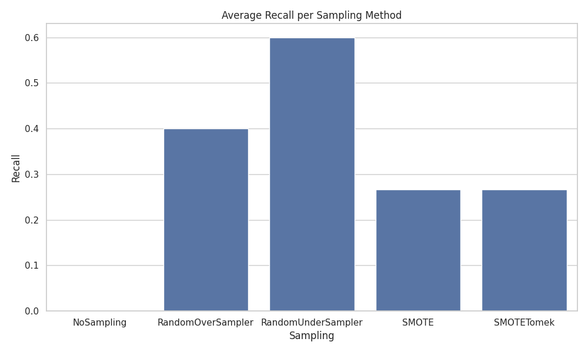
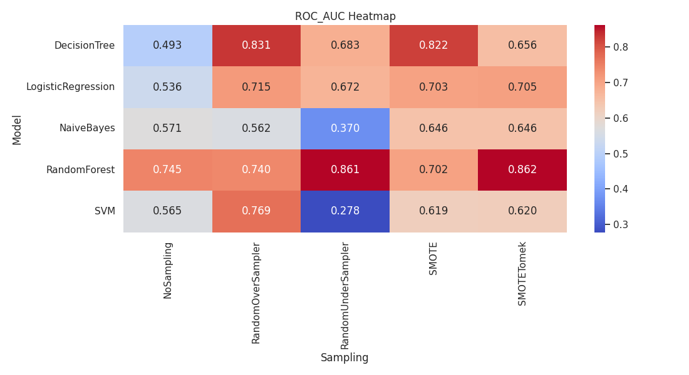

Sampling Techniques on an Imbalanced Credit Card Fraud Dataset

Objective

The goal of this assignment is to understand how different sampling techniques help when working with imbalanced datasets. In this case, we focus on credit card fraud detection and study how sampling methods affect the performance of various machine learning models.

Fraud detection is challenging because fraudulent transactions are very rare compared to legitimate ones. This imbalance can cause models to perform poorly if not handled properly.

Dataset
	•	Dataset: Creditcard_data.csv
	•	Target variable: Class
	•	0 → Legitimate transaction
	•	1 → Fraudulent transaction

The dataset is highly imbalanced, with only a small fraction of transactions labeled as fraud.

Methodology

1. Data Preparation
	•	The dataset was split into:
	•	Features (X): All columns except Class
	•	Target (y): Class
	•	A stratified 70:30 train–test split was used to maintain the original class distribution.
	•	Sampling techniques were applied only on the training set to avoid data leakage.

2. Sampling Techniques

Five sampling strategies were tested:

Sampling ID	Technique
Sampling1	No Sampling
Sampling2	Random Over Sampler
Sampling3	Random Under Sampler
Sampling4	SMOTE
Sampling5	SMOTE + Tomek Links

3. Machine Learning Models

Each sampling method was used with the following classifiers:

Model ID	Classifier
M1	Logistic Regression
M2	Decision Tree
M3	Random Forest
M4	Naive Bayes
M5	Support Vector Machine

4. Evaluation Metrics

Models were evaluated on the unseen test data using:
	•	Accuracy
	•	Precision
	•	Recall
	•	F1-Score
	•	ROC-AUC

Since fraud detection is a cost-sensitive problem, recall was treated as the most important metric. Missing a fraud case is usually more serious than incorrectly flagging a legitimate transaction.

Results and Analysis

Accuracy

Accuracy was above 97% for most models, even without sampling. However, this is misleading because the dataset is dominated by legitimate transactions. A model can predict almost everything as legitimate and still achieve high accuracy.

Recall

Recall measures how many actual fraud cases were correctly identified.
	•	Without sampling, most models had very low or zero recall.
	•	Sampling techniques significantly improved recall.
	•	Random Under Sampling achieved very high recall, especially with Random Forest.

Precision

Precision shows how many of the predicted fraud cases were actually fraud.
	•	When recall increased, precision often decreased.
	•	This trade-off is expected in fraud detection, where catching more frauds can lead to more false alarms.

F1-Score

The F1-score balances precision and recall.
	•	The best F1-scores were generally observed when sampling was used.
	•	Some combinations still had low F1-scores due to poor recall.

ROC-AUC

ROC-AUC measures how well the model can distinguish between fraud and non-fraud transactions.
	•	Random Forest consistently achieved strong ROC-AUC values.
	•	The combination of Random Forest with Random Under Sampling or SMOTE + Tomek Links performed particularly well.

Average Recall by Sampling Method

When recall was averaged across all models:
	•	Random Under Sampling gave the highest average recall.
	•	Random Over Sampling also performed well.
	•	SMOTE-based methods showed moderate improvement.

Best Sampling Method per Model (Based on Recall)
	•	Logistic Regression → Random Over Sampling
	•	Decision Tree → Random Over Sampling
	•	Random Forest → Random Under Sampling
	•	SVM → Random Over Sampling
	•	Naive Bayes → Performed poorly across most sampling methods

Metrics Summary (Highlights)

Model	Best Sampling	Recall	ROC-AUC
Logistic Regression	Random Over Sampling	High	~0.71
Decision Tree	Random Over Sampling	High	~0.83
Random Forest	Random Under Sampling	1.00	~0.86
SVM	Random Over Sampling	High	~0.77
Naive Bayes	None	0.00	Low

Final Conclusion
	•	Sampling techniques are essential when working with imbalanced datasets.
	•	Accuracy alone is not a reliable metric for fraud detection.
	•	Random Under Sampling provided the highest recall on average.
	•	The best overall performance was achieved using Random Forest with Random Under Sampling, which balanced high recall with strong ROC-AUC.
