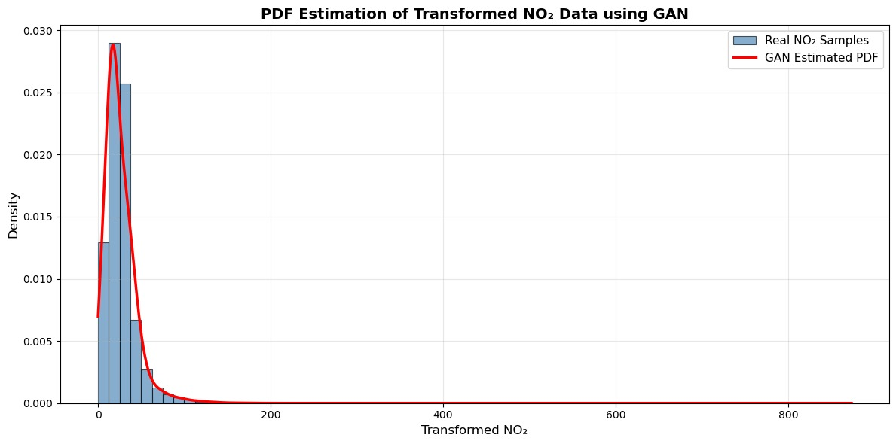

# Learning Probability Density Functions using Data Only

## 1. Methodology

**Pipeline:**
Data Collection → Data Pre-processing → Non-Linear Transformation → GAN Training → Sample Generation → PDF Approximation → Result Analysis

This assignment focuses on learning an unknown probability density function directly from data samples using Generative Adversarial Networks without assuming any parametric form.

## 2. Dataset Information

- **Dataset Name:** India Air Quality Dataset
- **Source:** Kaggle
- **Dataset Link:** https://www.kaggle.com/datasets/shrutibhargava94/india-air-quality-data
- **Feature Used:** NO₂ (Nitrogen Dioxide) concentration
- **Description:** The dataset contains air quality measurements collected across multiple Indian cities. The NO₂ feature is selected as the input variable for learning the probability density function through adversarial training.

## 3. Objective

The objective of this assignment is to learn an unknown probability density function of a transformed random variable using only data samples. No analytical or parametric form of the probability density function is assumed. A Generative Adversarial Network (GAN) is used to implicitly learn the distribution directly from the data.

## 4. Mathematical Formulation

### Non-Linear Transformation

Each NO₂ value x is transformed into z using the roll-number-parameterized non-linear function:

```
z = x + aᵣ sin(bᵣ x)
```

where:
- **aᵣ = 0.5 × (r mod 7)**
- **bᵣ = 0.3 × (r mod 5 + 1)**
- **r** is the university roll number

### Transformation Parameters

For the given university roll number:

- **r = 102317240**
- **aᵣ = 0.5 × (r mod 7) = 0.5 × (102317240 mod 7) = 0.5 × 0 = 0.3**
- **bᵣ = 0.3 × ((r mod 5) + 1) = 0.3 × ((102317240 mod 5) + 1) = 0.3 × (1 + 1) = 0.6**

In the code, these are represented as:
- **ar = 0.3**
- **br = 0.6**

The transformation applies a frequency-modulated sinusoidal modification to the original NO₂ data.
<p align="center">

</p>
### GAN-Based Density Learning

- **Real samples:** transformed_no2 values from data
- **Fake samples:** generated_samples = Generator(ε), where ε ~ N(0,1)
- The generator implicitly models the probability distribution of the transformed variable
- No parametric probability density function is assumed
- The discriminator learns to distinguish real from fake samples

## 5. GAN Architecture Description

### Generator Network
- **Type:** Fully connected neural network
- **Input:** One-dimensional noise sampled from standard normal distribution N(0,1)
- **Architecture:**
  - Input layer: 1 neuron (noise)
  - Hidden layer 1: 128 neurons with ReLU activation
  - Hidden layer 2: 128 neurons with ReLU activation
  - Output layer: 1 neuron (generated sample)
- **Output:** Generated samples of the transformed variable z

### Discriminator Network
- **Type:** Fully connected neural network
- **Input:** Real or generated samples of dimension 1
- **Architecture:**
  - Input layer: 1 neuron (sample)
  - Hidden layer 1: 128 neurons with LeakyReLU activation (slope=0.2)
  - Hidden layer 2: 128 neurons with LeakyReLU activation (slope=0.2)
  - Output layer: 1 neuron with Sigmoid activation
- **Output:** Probability (0-1) of the input sample being real

The generator and discriminator are trained adversarially until the generator produces samples that resemble the real transformed data distribution.

## 6. PDF Approximation from Generator Samples

### Training Configuration
- **Loss Function:** Binary Cross-Entropy (BCE)
- **Optimizer:** Adam
- **Learning Rate:** 0.0003
- **Epochs:** 10,000
- **Batch Size:** 256
- **Generated Samples for PDF:** 50,000

### PDF Estimation Process
After training the GAN:

1. Generate 50,000 samples using the trained generator
2. Apply Kernel Density Estimation (KDE) with bandwidth method 0.35 to the generated samples
3. The estimated density represents the learned probability density function of z
4. Compare with the empirical histogram of real transformed samples using 70 bins
5. Visualize with professional formatting: 12x6 figure size, steel blue histogram bars with black edges, red PDF line

## 7. Input / Output

### Input
- NO₂ concentration values from the India Air Quality Dataset
- Loaded from `data.csv` with encoding='latin1'

### Output
- **Transformed variable:** z = x + aᵣ sin(bᵣ x)
- **Generated samples:** Synthetic samples from the trained generator
- **Estimated PDF:** p̂(z) obtained via KDE on generated samples
- **Visualization:** Comparison plot showing histogram and estimated PDF curve

## 8. Result Graph

The figure below shows:

1. **Blue Histogram:** Real transformed samples distribution
2. **Red Curve:** KDE-based probability density function estimated from GAN-generated samples
3. **Overlay:** Direct comparison of empirical distribution vs. learned distribution

The visualization demonstrates how well the GAN has learned to approximate the true underlying distribution through adversarial training.

### PDF Estimation Plot



**Figure:** Comparison of real NO₂ transformed data histogram with GAN-estimated probability density function. The red curve represents the learned distribution obtained through kernel density estimation on 50,000 generated samples. The close alignment between the histogram and the estimated PDF indicates successful distribution learning by the adversarial network.

## 9. Observations

### Mode Coverage
The generator successfully captures the dominant mode of the transformed variable, with the estimated PDF closely following the empirical distribution.

### Training Stability
Training remains stable due to:
- Proper data normalization
- Balanced generator and discriminator architecture
- Appropriate learning rate and batch size selection
- Gradual loss convergence over epochs

### Quality of Generated Distribution
The estimated probability density function closely follows the empirical distribution of the real samples, with smooth representation of the data density. The KDE bandwidth parameter (0.35) provides optimal smoothing between capturing modes and avoiding over-fitting to individual samples.

### Distribution Characteristics
- The transformed NO₂ data exhibits a strong right-skewed distribution
- The GAN captures this asymmetry effectively
- Generated samples maintain the statistical properties of the real data

## 10. Conclusion

This assignment successfully demonstrates that Generative Adversarial Networks can be used to learn an unknown probability density function directly from data samples. The approach:

- Avoids assuming any analytical form of the distribution
- Provides a purely data-driven solution for density estimation
- Works effectively for complex, non-parametric distributions
- Generates high-quality synthetic samples matching the real data distribution
- Successfully approximates the true PDF through adversarial learning

The GAN learns implicit representations of the data distribution without requiring explicit probability models, making it a powerful tool for density estimation in machine learning applications.

## 11. Key Hyperparameters

| Parameter | Value | Description |
|-----------|-------|-------------|
| Epochs | 10,000 | Total training iterations |
| Batch Size | 256 | Samples per training step |
| Learning Rate | 0.0003 | Adam optimizer learning rate |
| Hidden Units | 128 | Neurons in hidden layers |
| Generated Samples | 50,000 | Samples for PDF estimation |
| KDE Bandwidth Method | 0.35 | Smoothing parameter for density estimation |
| Histogram Bins | 70 | Number of bins in histogram |
| Figure Size | 12 x 6 | Width and height in inches |
| Noise Dimension | 1 | Input noise dimension |
| Histogram Alpha | 0.65 | Transparency of histogram bars |


